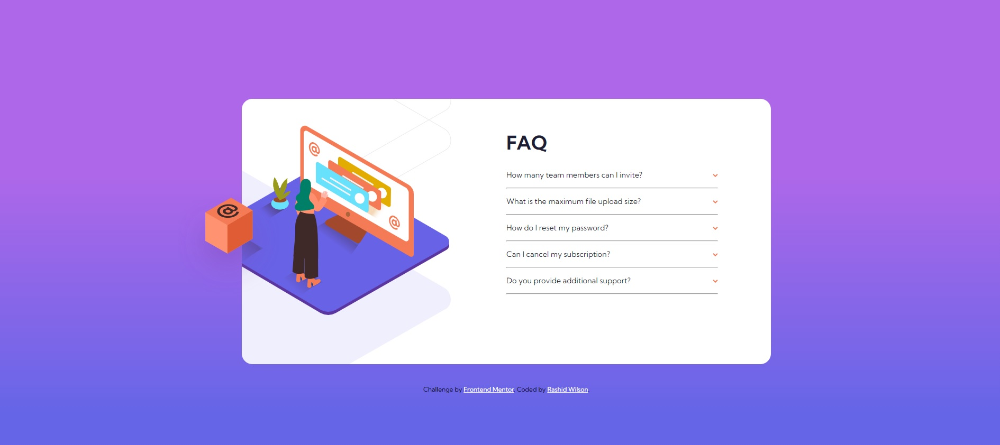

# Frontend Mentor - FAQ accordion card solution

This is a solution to the [FAQ accordion card challenge on Frontend Mentor](https://www.frontendmentor.io/challenges/faq-accordion-card-XlyjD0Oam). Frontend Mentor challenges help you improve your coding skills by building realistic projects. 

## Table of contents

- [Overview](#overview)
  - [The challenge](#the-challenge)
  - [Screenshot](#screenshot)
  - [Links](#links)
- [My process](#my-process)
  - [Built with](#built-with)
  - [What I learned](#what-i-learned)
  - [Continued development](#continued-development)
  - [Useful resources](#useful-resources)
- [Author](#author)

## Overview

### The challenge

Users should be able to:

- View the optimal layout for the component depending on their device's screen size
- See hover states for all interactive elements on the page
- Hide/Show the answer to a question when the question is clicked

### Screenshot

### Links

- Live Site URL: [Hosted on Github Pages](https://shangum.github.io/FAQ-Accordion-Card-Challenge-Frontend-Mentor/)

## My process

### Built with

- HTML
- CSS
- Sass
- Flexbox
- Mobile-first workflow
- JavaScript
- [jQuery](https://jquery.com/) - JS library

### What I learned

1) How to use css to rotate images: Initially I was looking for the "up arrow" icon in the challenges resource (I'm use to icon packs like font awesome so I was spoiled). I eventually found out that I would have to figure out how to flip the provided image based on the accordian state. During this challenge I discovered the "transform" css rule which I used to rotate the the icon. Very cool trick which I will definetly used in the future.

2) How to have images extend beyond their parent element: It was good getting familiar with this design style. I've never worked on a design like this and it was good practice handling overflows and working with negative margins.

3) Positioning background images of elements: It was a bit tricky figuring out how to get the background image to line up with the main images above. During this project I became more familiar with the background-position css rule.

4) Sass: I have been continuing to become more familiar with adding Sass to my workflow. Using Sass has been helping me in my journey to use responsive units mainly in my projects.

### Continued development

In the future I want to continue to use Sass and explore more of the advanced functionality.

### Useful resources

- [Displaying Gradient Background Correctly](https://stackoverflow.com/questions/2869212/css3-gradient-background-set-on-body-doesnt-stretch-but-instead-repeats) - Helped me to understand how to display a background gradient that doesn't repeat.
- [Online Gradient Generator](https://cssgradient.io/) - Useful tool that helped me easily generate a good looking gradient.
- [Sass pixel to Rems](https://dev.to/nikolab/convert-px-to-rem-using-sass-3-methods-4ep2) - Used to create a Sass function that helped me convert pixels to Rem units easily.
- [Background Position](https://www.w3schools.com/cssref/pr_background-position.asp) - Helped me to position background images on applied elements.
- [Flip An Image](https://css-tricks.com/snippets/css/flip-an-image/) - Showed me how to use css to flip images along their axis.
- [Maintaining Position of Elements with Absolute](https://stackoverflow.com/questions/59751166/how-to-keep-element-with-position-absolute-on-the-same-position-when-resizing) - Helped me in figuring out how to have a position absolute element (the box in this case) and keep it in the proper relative position when the screen resizes.

## Author

- Website - [Rashid Wilson](#)
- Frontend Mentor - [@shangum](https://www.frontendmentor.io/profile/shangum)
